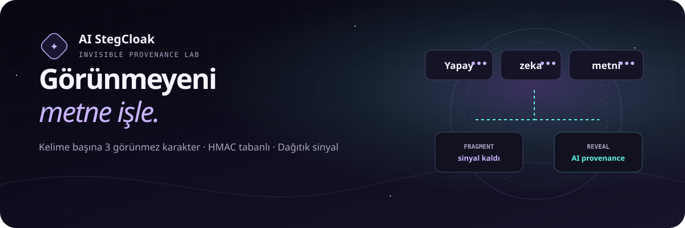
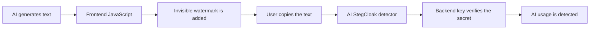
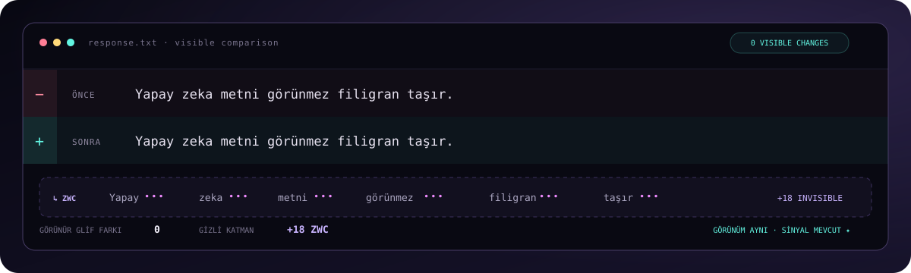
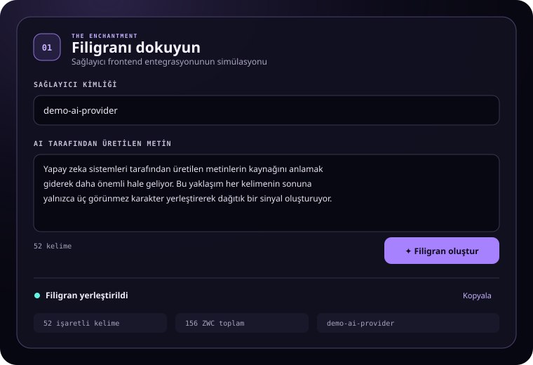
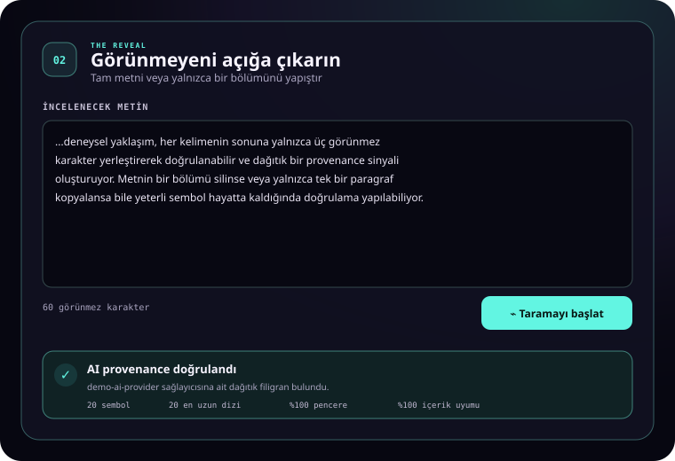

<p align="center">
  
</p>

<p align="center">
  <a href="README.md">Türkçe</a> · <strong>English</strong>
</p>

# AI StegCloak

An experimental project that adds an invisible watermark to AI-generated text immediately before it is displayed to the user, through JavaScript integrated into an AI service frontend.

> **In short:** AI generates text → JavaScript adds the watermark → The text is copied → The detector verifies the secret with a backend-only key.

## Where did the idea come from?

This project was inspired by [KuroLabs/StegCloak](https://github.com/kurolabs/stegcloak) and its approach of hiding password-protected secrets inside ordinary text with invisible Unicode characters. StegCloak is a general-purpose JavaScript steganography tool that compresses and encrypts a secret before placing it inside cover text. It uses AES-256-CTR, optional HMAC integrity protection, and six invisible Unicode characters. A live demo of the original project is available at [stegcloak.surge.sh](https://stegcloak.surge.sh/).

AI StegCloak adapts the same invisible-character idea to a different problem: **leaving a verifiable signal about the origin of an AI output instead of transporting a covert message.**

| | StegCloak | AI StegCloak |
| --- | --- | --- |
| Primary goal | Carry a secret message inside text | Verify AI-generated text later |
| Injection point | A secret is hidden inside cover text | A watermark is added by the provider after the AI response is generated |
| Distribution | Encrypted data is stored with invisible characters | A short, response-specific symbol sequence is distributed across words |
| Verification | The secret is revealed with a password | Provenance is verified with a backend key and registry |
| Partial copies | Not the primary objective | Recovering evidence from remaining words is a core objective |

This repository is not a fork of StegCloak. It is an independent research prototype that rethinks the technique for AI provenance. Instead of encrypting and decrypting a complete secret in the browser, the current MVP verifies a short HMAC sequence generated with a backend-only key.

## How does it work?



### 1. The AI generates its response normally

No watermark instruction is added to the model prompt. The watermark is injected in the frontend after generation, so it **does not increase the model's token usage**.

### 2. JavaScript adds the invisible watermark

The secret is distributed through the text with invisible Unicode characters:

```text
Visible:  Text generated by an artificial intelligence system
Actual:   Text[ZWC] generated[ZWC] by[ZWC] an[ZWC] artificial[ZWC] intelligence[ZWC] system[ZWC]
```

The user sees no visual difference. The current prototype adds only **3 invisible characters** to each word.

## Visible diff: `0`

The watermark does not alter the visible words, letters, or punctuation. The before and after lines look identical on screen:

```diff
- BEFORE  AI-generated text carries an invisible watermark.
+ AFTER   AI-generated text carries an invisible watermark.
```

```text
Visible glyph difference : 0
Hidden data difference   : +18 ZWCs (6 words × 3 characters)
```

In the second line, invisible Unicode characters are actually present after every word. They occupy no visible space, but they travel with the text when it is selected and copied. The system can therefore attach a verifiable signal without changing the visible content.

<p align="center">
  
</p>

### 3. The detector verifies the secret

The text under review is pasted into the detector. The backend extracts the invisible characters, reconstructs the secret sequence, and verifies it with a password or key that exists only on the backend.

```text
Text → Extract ZWCs → Reconstruct secret → Verify with backend key → AI watermark found
```

## Interface previews

<table>
  <tr>
    <td width="50%" valign="top">
      
      <br />
      <strong>Watermark creation</strong><br />
      <sub>Three invisible characters are added to each word of the AI response.</sub>
    </td>
    <td width="50%" valign="top">
      
      <br />
      <strong>Partial-text verification</strong><br />
      <sub>Symbols surviving in a copied fragment are verified by the backend.</sub>
    </td>
  </tr>
</table>

## The secret

The simplest secret only indicates that the text is AI-generated:

```json
{ "type": "ai-generated" }
```

A provider identifier and random response identifier can optionally be included:

```json
{
  "type": "ai-generated",
  "provider": "example-ai",
  "responseId": "random-id"
}
```

> [!IMPORTANT]
> The password or master key must never be placed in frontend JavaScript. The frontend should only receive watermarked text or opaque watermark data produced by the backend.

## Minimal frontend integration

```js
async function showAiResponse(aiText) {
  const response = await fetch("/api/v1/watermarks/mint", {
    method: "POST",
    headers: { "Content-Type": "application/json" },
    body: JSON.stringify({
      providerId: "example-ai",
      text: aiText,
    }),
  });

  const { watermarkedText } = await response.json();
  document.querySelector("#ai-answer").textContent = watermarkedText;
}
```

In production, the `/mint` request should pass through the provider's trusted backend or be signed by the provider.

## Why distribute it across the text?

If a secret is placed only at the end of the text, it can be lost when a user copies a single paragraph. When invisible symbols are distributed across words, the remaining markers may still provide enough evidence even if part of the text is deleted or edited.

If a fragment is too short to contain sufficient evidence, the system returns `insufficient_evidence` instead of making a definitive claim.

## User-tracking potential

The default goal is only to detect AI usage. The current prototype does not store user, IP address, or prompt information.

Technically, a registry entry could be associated with an anonymous session or user account. This could be useful in data-leak investigations, but it could also become a form of invisible user tracking.

If identity-related tracking is ever added:

- An identity must not be written directly into the watermark.
- A public detector must not reveal user identities.
- Identity mapping should be disabled by default.
- The registry should be encrypted and retained only for a limited period.
- Access should be restricted to authorized, logged incident investigations.

## Security boundaries

| Risk | Result |
| --- | --- |
| Removing all ZWCs | The watermark may be destroyed. |
| Transplanting a watermark to another text | Attribution may be false; a content fingerprint is checked to reduce this risk. |
| Placing the password in the frontend | The password can be extracted from the browser. |
| Leaving the `/mint` endpoint unprotected | Human-written text could receive a valid AI watermark. |
| Registry compromise | User mapping, if enabled, could create a privacy breach. |

> [!NOTE]
> A “watermark not detected” result does not prove that a human wrote the text. The watermark may never have been added or may have been removed later.

## Running locally

Node.js 22 or newer is sufficient. There are no external package dependencies.

```bash
npm test
npm start
```

Then open [http://localhost:8787](http://localhost:8787).

Backend password or master key:

```bash
WATERMARK_MASTER_KEY="at-least-32-random-bytes" npm start
```

The default development key is intended for local demos only.

## API

```http
POST /api/v1/watermarks/mint
POST /api/v1/watermarks/detect
GET  /api/health
```

Example verified result:

```json
{
  "status": "verified_ai_provenance",
  "aiProvenance": true,
  "providerId": "example-ai"
}
```

## Current status

- 3 invisible characters per word
- Response-specific secret sequence derived from the backend key
- Tolerance for partial copying and ordinary edits
- Watermark-transplant detection
- Node.js API and web interface
- Temporary in-memory registry

This release is a research prototype. The registry is not persistent, and provider authentication has not yet been implemented.

Technical details: [AI StegCloak Protocol v0.1](docs/PROTOCOL.md)
