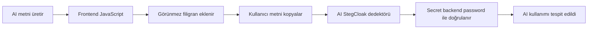

<p align="center">
  
</p>

<p align="center">
  <strong>Türkçe</strong> · <a href="README.en.md">English</a>
</p>

# AI StegCloak

AI servislerinin frontend’ine eklenen JavaScript ile, üretilmiş metne kullanıcıya gösterilmeden hemen önce görünmez filigran ekleyen bir araştırma projesi.

> **Kısaca:** AI metni üretir → JavaScript filigranı ekler → Metin kopyalanır → Dedektör secret’ı password ile doğrular.

## Fikir nereden çıktı?

Bu proje, [KuroLabs/StegCloak](https://github.com/kurolabs/stegcloak) projesinin görünmez Unicode karakterleriyle normal metnin içine parola korumalı secret gizleme, SynthID görünmez filigran ve LinkedIn Content Credentials fikirlerinden ilham aldı. StegCloak; secret’ı sıkıştırıp şifreleyerek bir “cover text” içine saklayan, JavaScript tabanlı genel amaçlı bir steganografi aracıdır. AES-256-CTR, isteğe bağlı HMAC bütünlük kontrolü ve altı farklı görünmez Unicode karakteri kullanır. Orijinal projenin çalışan demosu [stegcloak.surge.sh](https://stegcloak.surge.sh/) adresindedir.

SynthID, Google DeepMind tarafından geliştirilen, yapay zeka tarafından üretilen içeriklere (görsel, ses, video ve metin) doğrudan ve görünmez bir dijital filigran ekleyen ve bu içerikleri tespit eden bir teknolojidir.

LinkedIn Content Credentials ise, paylaşılan görsel ve video gibi medya içeriklerinin kaynağını, geçmişini ve yapay zekâ ile üretilip üretilmediğini gösteren güvenli bir şeffaflık sistemidir.

AI StegCloak aynı görünmez karakter fikrini farklı bir probleme uyarlar: **gizli mesaj taşımak yerine AI çıktısının kaynağına ilişkin doğrulanabilir bir sinyal bırakmak.**

| | StegCloak | AI StegCloak |
| --- | --- | --- |
| Ana amaç | Metin içinde gizli mesaj taşımak | AI üretimi metni sonradan doğrulamak |
| Yerleştirme | Secret bir cover text içine gizlenir | Filigran AI cevabı üretildikten sonra sağlayıcı arayüzünde eklenir |
| Dağıtım | Şifreli veri görünmez karakterlerle saklanır | Kısa, cevap-spesifik sembol dizisi kelimelere dağıtılır |
| Doğrulama | Parolayla secret açılır | Backend anahtarı ve registry ile provenance doğrulanır |
| Parçalı kopya | Temel hedef değildir | Kalan kelimelerden kanıt üretebilmek temel hedeftir |

Bu depo StegCloak’ın bir fork’u değildir; onun ortaya koyduğu tekniği AI provenance senaryosu için yeniden ele alan bağımsız bir araştırma prototipidir. Mevcut MVP secret’ın tamamını tarayıcıda şifreleyip çözmek yerine, backend anahtarıyla üretilen kısa bir HMAC dizisini doğrular.

## Nasıl çalışır?



### 1. AI cevabı normal şekilde üretir

Modelin prompt’una filigran talimatı eklenmez. Filigran üretim bittikten sonra frontend’de yerleştirildiği için modelin kullandığı **token sayısını artırmaz**.

### 2. JavaScript görünmez filigranı ekler

Secret, görünmez Unicode karakterleriyle metne dağıtılır:

```text
Görünen:   Yapay zeka tarafından üretilen metin
Gerçekte:  Yapay[ZWC] zeka[ZWC] tarafından[ZWC] üretilen[ZWC] metin[ZWC]
```

Kullanıcı görsel bir fark görmez. Mevcut prototip her kelimeye yalnızca **3 görünmez karakter** ekler.

## Görünür diff: `0`

Filigran metnin görünür sözcüklerini, harflerini veya noktalamasını değiştirmez. Önce ve sonra satırları ekranda aynı görünür:

```diff
- ÖNCE   Yapay zeka metni görünmez filigran taşır.
+ SONRA  Yapay zeka metni görünmez filigran taşır.
```

```text
Görünür glif farkı : 0
Gizli veri farkı   : +18 ZWC (6 kelime × 3 karakter)
```

Gerçekte ikinci satırdaki her kelimenin sonunda görünmez Unicode karakterleri bulunur. Bunlar yer kaplamaz ve gözle görünmez; ancak metin seçilip kopyalandığında onunla birlikte taşınır. Bu nedenle sistem görünür metni değiştirmeden doğrulanabilir bir sinyal ekleyebilir.

<p align="center">
  
</p>

### 3. Dedektör secret’ı doğrular

İncelenecek metin dedektöre yapıştırılır. Backend görünmez karakterleri çıkarır, secret dizisini yeniden oluşturur ve yalnızca kendisinde bulunan password/anahtar ile doğrular.

```text
Metin → ZWC'leri çıkar → Secret'ı oluştur → Password ile doğrula → AI filigranı bulundu
```

## Arayüz ön izlemeleri

<table>
  <tr>
    <td width="50%" valign="top">
      
      <br />
      <strong>Filigran oluşturma</strong><br />
      <sub>AI cevabına kelime başına üç görünmez karakter eklenir.</sub>
    </td>
    <td width="50%" valign="top">
      
      <br />
      <strong>Parçalı metin doğrulama</strong><br />
      <sub>Kopyalanmış bir bölümde hayatta kalan semboller backend tarafından doğrulanır.</sub>
    </td>
  </tr>
</table>

## Secret

En basit secret yalnızca metnin AI çıktısı olduğunu belirtir:

```json
{ "type": "ai-generated" }
```

İstenirse sağlayıcı ve rastgele cevap kimliği eklenebilir:

```json
{
  "type": "ai-generated",
  "provider": "example-ai",
  "responseId": "random-id"
}
```

> [!IMPORTANT]
> Password frontend JavaScript’ine konmaz. Frontend yalnızca backend’in ürettiği filigranlı metni veya opak filigran verisini kullanır.

## Basit frontend entegrasyonu

```js
async function showAiResponse(aiText) {
  const response = await fetch("/api/v1/watermarks/mint", {
    method: "POST",
    headers: { "Content-Type": "application/json" },
    body: JSON.stringify({
      providerId: "example-ai",
      text: aiText,
    }),
  });

  const { watermarkedText } = await response.json();
  document.querySelector("#ai-answer").textContent = watermarkedText;
}
```

Gerçek kullanımda `/mint` isteği sağlayıcının güvenilir backend’i üzerinden yapılmalı veya sağlayıcı tarafından imzalanmalıdır.

## Neden metne dağıtılıyor?

Secret yalnızca metnin sonuna eklenirse kullanıcı tek bir paragrafı kopyaladığında kaybolabilir. Görünmez semboller kelimelere dağıtıldığında metnin bir bölümü silinse veya özelleştirilse bile kalan işaretler tespit için kullanılabilir.

Çok kısa bir parçada yeterli sembol yoksa sistem kesin karar vermek yerine `insufficient_evidence` döndürür.

## Kullanıcı takibi potansiyeli

Varsayılan amaç yalnızca AI kullanımını tespit etmektir. Mevcut prototip kullanıcı, IP veya prompt bilgisi saklamaz.

Teknik olarak registry kaydı anonim bir oturum veya kullanıcı hesabıyla eşleştirilebilir. Bu, veri sızıntısı araştırmalarında yararlı olabilir; fakat görünmez kullanıcı takibine de dönüşebilir.

Bu nedenle kişisel takip özelliği eklenirse:

- Kimlik doğrudan filigrana yazılmamalıdır.
- Kamuya açık dedektör kullanıcı kimliği göstermemelidir.
- Eşleme varsayılan olarak kapalı olmalıdır.
- Registry şifrelenmeli ve sınırlı süre tutulmalıdır.
- Erişim yalnızca yetkili ve kayıt altına alınan olay incelemeleriyle sınırlandırılmalıdır.

## Güvenlik sınırları

| Risk | Sonuç |
| --- | --- |
| Tüm ZWC’lerin silinmesi | Filigran kaybolabilir. |
| Filigranın başka metne taşınması | Yanlış atıf oluşabilir; içerik fingerprint’i kontrol edilir. |
| Password’ün frontend’e konması | Password tarayıcıdan çıkarılabilir. |
| Korumasız `/mint` endpoint’i | İnsan metinleri geçerli AI filigranı alabilir. |
| Registry sızıntısı | Kullanıcı eşlemesi varsa mahremiyet ihlali oluşabilir. |

> [!NOTE]
> “Filigran bulunamadı” sonucu metnin insan tarafından yazıldığını kanıtlamaz. Filigran hiç eklenmemiş veya sonradan temizlenmiş olabilir.

## Çalıştırma

Node.js 22 veya üzeri yeterlidir. Harici paket bağımlılığı yoktur.

```bash
npm test
npm start
```

Ardından [http://localhost:8787](http://localhost:8787) adresini açın.

Backend password/anahtarı:

```bash
WATERMARK_MASTER_KEY="en-az-32-byte-rastgele-bir-password" npm start
```

Varsayılan geliştirme anahtarı yalnızca yerel demo içindir.

## API

```http
POST /api/v1/watermarks/mint
POST /api/v1/watermarks/detect
GET  /api/health
```

Başarılı bir tespit örneği:

```json
{
  "status": "verified_ai_provenance",
  "aiProvenance": true,
  "providerId": "example-ai"
}
```

## Mevcut durum

- Kelime başına 3 görünmez karakter
- Backend anahtarından türetilen cevap-spesifik secret dizisi
- Parçalı kopyalama ve olağan düzenlemelere tolerans
- Filigran nakli kontrolü
- Node.js API ve web arayüzü
- Bellek içi geçici registry

Bu sürüm bir araştırma prototipidir. Registry henüz kalıcı değildir ve sağlayıcı kimlik doğrulaması uygulanmamıştır.

Teknik ayrıntılar: [AI StegCloak Protocol v0.1](docs/PROTOCOL.md)
